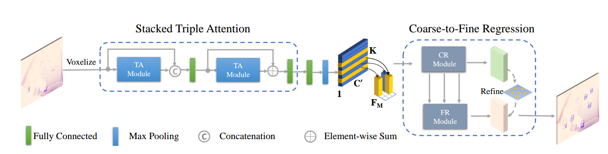
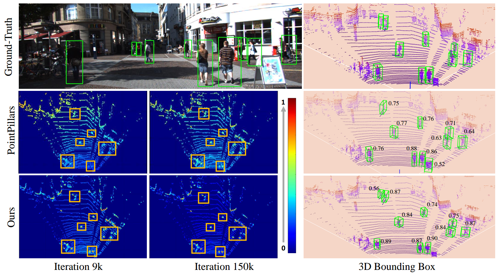

# TANet

Our code is mainly based on [PointPillars](https://github.com/nutonomy/second.pytorch) and [SECOND](https://github.com/traveller59/second.pytorch), thanks for them! We also plan to introduce TensorRT to further improve the inference speed. For more information please refer the [Paper](https://arxiv.org/pdf/1912.05163.pdf).  
### NEWS UPDATE!  
**Add TANet to the newest [second.pytorch](https://github.com/traveller59/second.pytorch).** 
TANet in second.pytorch package achieves the same performance with pointpillars_with_TANet, so I suggest you use second.pytorch_with_TANet instead. In addition, only using TA moudle in Nuscenes achieves an obvious  improvement than pointpillars in Nuscenes dataset.  (Note: On Nuscenes dataset, don't use PSA or other refinemnets, just use the TA module.  )


## The network architecture of [TANet](https://arxiv.org/pdf/1912.05163.pdf)

    First, we equally divide the point clouds into a voxel grid consisting of a set of voxels. Then, the stacked triple attention separately process each voxel to obtain a more discriminative representation. Subsequently, a compact feature representation for each voxel is extracted by aggregating the points inside it in a max-pooling manner. And we arrange the voxel feature according to its original spatial position in the grid, and thus lead to a feature representation for the voxel grid in the shape of C' × H × W . Finally, the coarse-to-fine regression is employed to generate the final 3D bounding boxes.


## Visualization

The visualization of learned feature map and predicted confidence score for PointPillars and Ours:


## Discussion for TANet


## TANet for [PointPillars](https://github.com/nutonomy/second.pytorch) 
### Start Up
Experiment: Tested in Ubuntu 16.04 with python 3.6+, pytorch 1.0.0+, CUDA9.0 in Titan XP/Titan V.

### Install:
you can refer the following steps or directly refer  [PointPillars](https://github.com/nutonomy/second.pytorch) 

#### 1. Clone code
	git clone https://github.com/happinesslz/TANet.git

#### 2. Install dependence python packages

	conda install scikit-image scipy numba pillow matplotlib
	pip install fire tensorboardX protobuf opencv-python shapely easydict pybind11


#### 3. Setup cuda for numba

Add following environment variables for numba to ~/.bashrc (**Optional**):

```
export NUMBAPRO_CUDA_DRIVER=/usr/lib/x86_64-linux-gnu/libcuda.so
export NUMBAPRO_NVVM=/usr/local/cuda-9.0/nvvm/lib64/libnvvm.so
export NUMBAPRO_LIBDEVICE=/usr/local/cuda-9.0/nvvm/libdevice
```
	source ~/.bashrc

#### 4. PYTHONPATH

Add TANet/pointpillars_with_TANet/ to your PYTHONPATH.

### Prepare dataset
#### 1. Dataset preparation

Download KITTI dataset and create some directories first:

```plain
└── KITTI_DATASET_ROOT
       ├── training    <-- 7481 train data
       |   ├── image_2 <-- for visualization
       |   ├── calib
       |   ├── label_2
       |   ├── velodyne
       |   └── velodyne_reduced <-- empty directory
       └── testing     <-- 7580 test data
           ├── image_2 <-- for visualization
           ├── calib
           ├── velodyne
           └── velodyne_reduced <-- empty directory
```

Note: PointPillar's protos use ```KITTI_DATASET_ROOT=/data/sets/kitti_second/```.

#### 2. Create kitti infos:

```bash
python create_data.py create_kitti_info_file --data_path=KITTI_DATASET_ROOT
```

#### 3. Create reduced point cloud:

```bash
python create_data.py create_reduced_point_cloud --data_path=KITTI_DATASET_ROOT
```

#### 4. Create groundtruth-database infos:

```bash
python create_data.py create_groundtruth_database --data_path=KITTI_DATASET_ROOT
```

#### 5. Modify config file

The config file needs to be edited to point to the above datasets:

```bash
train_input_reader: {
  ...
  database_sampler {
    database_info_path: "/path/to/kitti_dbinfos_train.pkl"
    ...
  }
  kitti_info_path: "/path/to/kitti_infos_train.pkl"
  kitti_root_path: "KITTI_DATASET_ROOT"
}
...
eval_input_reader: {
  ...
  kitti_info_path: "/path/to/kitti_infos_val.pkl"
  kitti_root_path: "KITTI_DATASET_ROOT"
}
```

### Run the Code 
The common can be found in pointpillars_with_TANet/second/*sh
#### 1. Train TANet for Car 
	bash run_car_16_tanet.sh
#### 2. Train TANet for Ped&Cyc
	bash run_ped_cycle_16_tanet.sh
Note:  you need specify the absolute  path of Model_Path

### Results on TANet
**Trained model is available (Note: Please use the newest code!):**
1. **Google Driver:** https://drive.google.com/drive/folders/1jSuQy5svfkDBw_4JszSzmIp9tpH1Ox7f
2. **Baiduyunpan:** https://pan.baidu.com/s/1TfeYpkyRORPFLktS9REc2g   
 **Password:**  5fe1

#### 1. Car
```
Car AP@0.70, 0.70, 0.70:
bbox AP:90.81, 89.56, 87.91
bev  AP:89.90, 86.94, 86.44
3d   AP:88.17, 77.75, 75.31
aos  AP:90.75, 89.18, 87.20
Car AP@0.70, 0.50, 0.50:
bbox AP:90.81, 89.56, 87.91
bev  AP:90.86, 90.25, 89.43
3d   AP:90.85, 90.16, 89.19
aos  AP:90.75, 89.18, 87.20
```

#### 2.Ped&Cyc (Only one model) 
```
Cyclist AP@0.50, 0.50, 0.50:
bbox AP:86.94, 70.20, 66.22
bev  AP:86.20, 67.70, 63.42
3d   AP:85.21, 65.29, 61.57
aos  AP:86.75, 69.88, 65.89
Cyclist AP@0.50, 0.25, 0.25:
bbox AP:86.94, 70.20, 66.22
bev  AP:86.82, 71.54, 66.99
3d   AP:86.72, 70.49, 65.43
aos  AP:86.75, 69.88, 65.89
Pedestrian AP@0.50, 0.50, 0.50:
bbox AP:70.74, 67.94, 63.76
bev  AP:78.55, 71.41, 66.03
3d   AP:71.04, 64.20, 59.11
aos  AP:52.15, 50.10, 47.10
Pedestrian AP@0.50, 0.25, 0.25:
bbox AP:70.74, 67.94, 63.76
bev  AP:86.90, 82.47, 78.98
3d   AP:86.89, 82.47, 78.96
aos  AP:52.15, 50.10, 47.10
```


## TANet for [Second.Pytorch](https://github.com/traveller59/second.pytorch) 
### Start Up
Refer the README in  [second.pytorch](https://github.com/traveller59/second.pytorch) . 

Note:
**you need to specify the " Dataset: Kitti" or "Dataset: Nuscenes" in "tanet.yaml"** 

### On KITTI
1. Prepare dataset:
```bash
python create_data.py kitti_data_prep --root_path=/mnt/data2/Kitti_for_TANet_2/object
```
2. Training
```bash
CUDA_VISIBLE_DEVICES=5 python ./pytorch/train.py train --config_path=./configs/tanet/car/xyres_16.config --model_dir=/mnt/data2/TANet_2/second.pytorch/second/train_car_tanet_weight_2  --refine_weight=2
```
3. Testing
```bash
CUDA_VISIBLE_DEVICES=5 python ./pytorch/train.py evaluate --config_path=./configs/tanet/car/xyres_16.config --model_dir=/mnt/data2/TANet_2/second.pytorch/second/train_car_tanet_weight_2 --measure_time=True --batch_size=1
```
### On Nuscenes
NuScenes dataset:
```plain
└── NUSCENES_TRAINVAL_DATASET_ROOT
       ├── samples       <-- key frames
       ├── sweeps        <-- frames without annotation
       ├── maps          <-- unused
       └── v1.0-trainval <-- metadata and annotations
└── NUSCENES_TEST_DATASET_ROOT
       ├── samples       <-- key frames
       ├── sweeps        <-- frames without annotation
       ├── maps          <-- unused
       └── v1.0-test     <-- metadata
```

1. Prepare dataset:
```bash
python create_data.py nuscenes_data_prep --root_path=/mnt/data4/NuScenes/train --version="v1.0-trainval" --max_sweeps=10 --dataset_name="NuScenesDataset"

python create_data.py nuscenes_data_prep --root_path=/mnt/data4/NuScenes/test --version="v1.0-test" --max_sweeps=10 --dataset_name="NuScenesDataset"
```

2. Training
```bash
CUDA_VISIBLE_DEVICES=4 python ./pytorch/train.py train --config_path=./configs/nuscenes/all.pp.lowa_only_add_ta_model.config --model_dir=/mnt/data2/TANet_2/second.pytorch/second/train_all_lowa_nuscenes_only_ta_module 
```

3. Testing
```bash
CUDA_VISIBLE_DEVICES=4 python ./pytorch/train.py train --config_path=./configs/nuscenes/all.pp.lowa_only_add_ta_model.config --model_dir=/mnt/data2/TANet_2/second.pytorch/second/train_all_lowa_nuscenes_only_ta_module 
```


## Citation
If you find our work useful in your research, please consider citing:
``` 
         @article{liu2019tanet,
         title={TANet: Robust 3D Object Detection from Point Clouds with Triple Attention},
         author={Zhe Liu and Xin Zhao and Tengteng Huang and Ruolan Hu and Yu Zhou and Xiang Bai},
         year={2020},
         journal={AAAI},
         url={https://arxiv.org/pdf/1912.05163.pdf},
         eprint={1912.05163},
         archivePrefix={arXiv},
         primaryClass={cs.CV}
         }
```

```
         @article{lang2018pointpillars,
         title={PointPillars: Fast Encoders for Object Detection from
         Point Clouds},
         author={Lang, Alex H and Vora, Sourabh and Caesar,
         Holger and Zhou, Lubing and Yang, Jiong and Beijbom,
         Oscar},
         journal={CVPR},
         year={2019}
         }
```

```   
           @article{yan2018second,
           title={Second: Sparsely embedded convolutional detection},
           author={Yan, Yan and Mao, Yuxing and Li, Bo},
           journal={Sensors},
           volume={18},
           number={10},
           pages={3337},
           year={2018},
           publisher={Multidisciplinary Digital Publishing Institute}
         }
```

## Acknowledgement

Our work builds on the  excellent works, which include:

- [pointpillars](<https://github.com/nutonomy/second.pytorch>) 
- [second.pytorch](<https://github.com/traveller59/second.pytorch>) 

​         

​        

